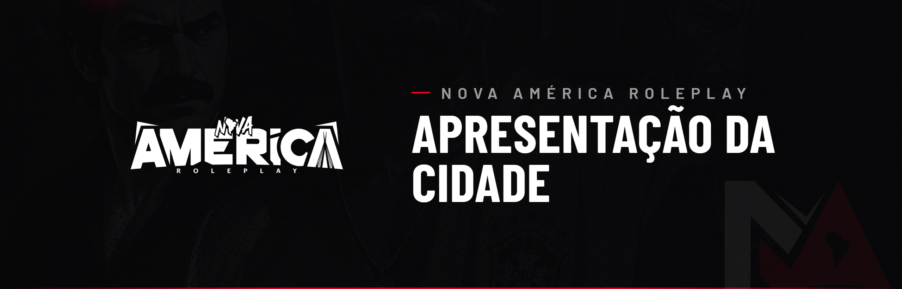

# 🎴 NOVA AMÉRICA

A **Nova América** é uma cidade de roleplay pertencente à **IRON VISION GROUP**, criada e pensada desde o início para trazer diferenciais reais aos jogadores. Todos os nossos sistemas foram desenvolvidos pela própria equipe — scripts novos e exclusivos, feitos para enriquecer e aprofundar o roleplay.

Nosso objetivo é entregar uma experiência diferenciada: uma cidade com economia extremamente regulada, sistemas policiais realistas e mecânicas que trazem peso e consequência para cada ação dentro do jogo.

***

## 🌎 Um continente, três países

A Nova América não é apenas uma cidade — é um continente vivo, dividido em **três países**, cada um com sua própria economia, poder e conflitos. As fronteiras são reais, e o que acontece em um país afeta todos os outros.

***

### 🇵🇾 PARAGUAI — Norte

O Paraguai é um país onde as **forças milicianas tomaram o poder**. Desde então, toda a economia paraguaia se sustenta no **fornecimento de itens ilegais** para os outros países.

É do Paraguai que saem os **armamentos, munições e a moamba** que abastecem o crime organizado da região. Um **Exército** miliciano comanda o território, defende suas fronteiras e luta para manter viva essa economia de guerra.

Quem quer poder de fogo, mais cedo ou mais tarde, precisa negociar com o Paraguai.

***

### 🇧🇷 BRASIL — Centro (São Paulo)

O Brasil é o coração da Nova América — é **onde o roleplay acontece de fato**, com o tema **São Paulo**.

Aqui vivem as **facções paulistas**, os civis, os trabalhadores e as forças de segurança. É uma cidade com **economia extremamente regulada**, **sistemas policiais realistas** e mecânicas pensadas para fazer diferença de verdade no roleplay.

Tudo converge para o Brasil: as armas que vêm do Paraguai, as drogas que vêm da Colômbia, e os conflitos que nascem nas ruas e favelas de São Paulo.

***

### 🇨🇴 COLÔMBIA — Sul

A Colômbia é dominada pelo **Cartel El Patrón**, sediado em seu quartel na ilha. O cartel controla toda a **produção de drogas** e gerencia a rede de **favelas e distribuição** ligada a esse mercado.

El Patrón decidiu **expandir seu poder** para além das fronteiras: hoje, controla a produção e a distribuição de drogas que abastecem também o Brasil e influencia o restante do continente. Nenhuma facção de drogas cresce sem passar pelo aval do cartel.

***


Cada país possui regras próprias de acesso, conduta, economia e soberania. Todas estão detalhadas nos códigos específicos deste manual (Território, Exércitos, Cartel, Polícia e demais).



**Bem-vindo à Nova América.** Ao entrar, você aceita fazer parte de um mundo onde cada ação tem consequência, cada país tem seu poder, e cada escolha constrói a sua história. Leia todos os códigos com atenção — o desconhecimento das regras não isenta ninguém de responsabilidade.

