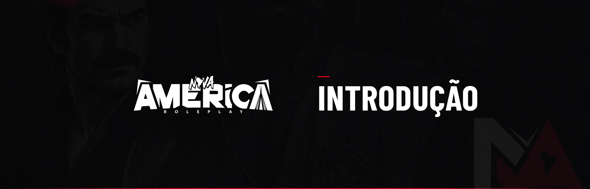

# 📚 Introdução

Este manual reúne **todos os códigos, normas e diretrizes** da Nova América Roleplay. Ele é a base máxima para julgamento por parte da Staff, dos Responsáveis de cada área e da Administração Geral.

***

### Como o manual funciona

* Cada **código** trata de uma área da cidade (RP, ilegal, polícia, exército, etc.);
* Cada regra pode ter uma **penalidade** associada, exibida em destaque;
* As penalidades são aplicadas conforme a **gravidade, a reincidência e o impacto no Roleplay**;
* A Administração pode **interpretar, agravar ou flexibilizar** sanções para preservar o RP sério.

***

### Sobre denúncias

Toda denúncia deve ser feita **exclusivamente via ticket no Discord**, acompanhada de clipe com o contexto completo (mínimo de 2 minutos). Denúncias por call, prints soltos ou clipes editados de forma tendenciosa **não serão analisadas** e podem gerar advertência a quem abriu.


Ao permanecer na Nova América, o jogador declara estar ciente de que todos os códigos aqui descritos estão publicamente disponíveis para consulta. O desconhecimento ou a interpretação equivocada de qualquer conteúdo **não** isenta o jogador de responsabilidade.

