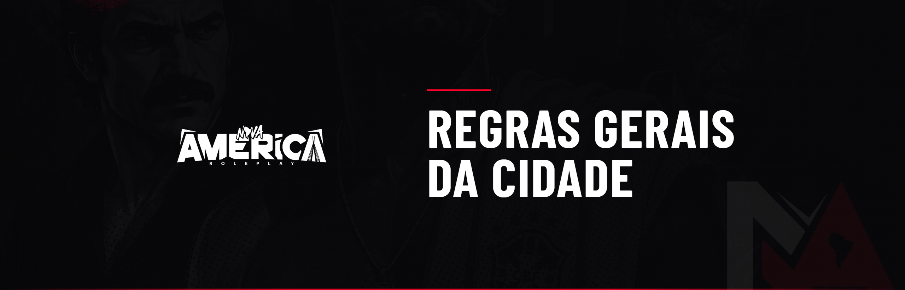

# 📋 Regras Gerais da Cidade

Estas são as regras gerais de convivência e conduta da Nova América. Valem para **todos os jogadores**, em qualquer país, função ou organização.

***

## 1 — Regras de Discord

**1.1** — O contato com membros da Staff via mensagem direta está **proibido**. Qualquer informação passada fora de ticket ou dos canais oficiais será descartada para fins de denúncia ou atendimento.

**1.2** — Proibido qualquer divulgação não autorizada no chat geral. Divulgações só nas salas destinadas a isso.

**1.3** — Proibido usar canais para fins diferentes dos destinados.

**1.4** — Proibido linguagem ofensiva, racista, homofóbica ou qualquer preconceito.

**1.5** — Proibido usar chats de acesso geral para discussões, brigas ou farpas.

**1.6** — Toda denúncia deve vir acompanhada do **clipe inteiro** da ação. Clipes sem contexto ou cortados de forma tendenciosa geram advertência.


**Penalidade:** Advertência. Reincidência: retirada de whitelist por 48 horas.


***

## 2 — Regras de Personagem

**2.1** — Personagens devem ter **nome registrável em cartório**. Caso contrário, a administração alterará para um nome aleatório, corrigível apenas via TJ.

**2.2** — Personagem que sai de uma facção (por qualquer motivo) **não pode** retornar a ela nem entrar em outra pelo prazo mínimo de **3 dias corridos**.


**Penalidade:** Alteração de nome / advertência conforme o caso.


***

## 3 — Conduta na Cidade

**3.1** — Discriminação é expressamente proibida (art. 3º, IV da Constituição Federal).

**3.2** — Não é permitido sair do roleplay sob nenhuma circunstância.

**3.3** — Proibido RP de assédio, importunação sexual, racismo, homofobia, xenofobia, suicídio e afins.

**3.4** — Em serviço legal, proibido qualquer atividade ilegal.

**3.5** — Após ser nocauteado propositalmente, você esquece todo o ocorrido, mesmo se reanimado (New Life Rule).

**3.6** — Proibido modificações visuais/sonoras que gerem vantagem (remover noite, mods de arma, mod de som que altere passos, etc.).

**3.7** — Proibido chamar serviços legais para debochar, sequestrar, roubar ou emboscar.

**3.8** — Permitido no máximo 2 pessoas na moto e 1 no porta-malas do carro.

**3.9** — Proibido roubo/furto de VTR.

**3.10** — Morto em troca de tiros não pode voltar para resgatar corpos ou veículos, nem retornar à mesma ação.

**3.11** — **Caixa 2 é proibido** em qualquer organização. Vender itens por dinheiro real = banimento permanente.

**3.12** — Proibido usar veículos ou roupas de empregos legais para cometer crimes.

**3.13** — Descobriu um bug e não reportou? Banimento permanente.

**3.14** — O bom senso é a chave. Antes de agir, pense se faria isso na vida real.

**3.15** — Xingamento, dedo ou colisão não são motivo para matar.

**3.16** — Proibido música dentro do hospital e delegacia.

**3.17** — Divulgar ou citar outro servidor = banimento.

**3.18** — Proibido binds e animações em ações.

**3.19** — Proibido revistar desmaiados em ação da qual você não participou (exceto polícia em QRU de disparo).

**3.20** — Resgate só com clipe das informações do conduzido, apenas no trajeto até a DP. Proibido invadir DP para resgatar.

**3.21** — Safe zones = sem ações ilegais. Áreas de risco = atividade ilícita e risco à vida.

**3.22** — Não aceitamos staff de outros servidores jogando na Nova América.

**3.23** — Proibido retornar a ação na qual desmaiou.

**3.24** — Proibido FUZIL ou SMG na área central (Cidade). Exceção: interior de favela ou ação blipada. Polícia segue regras internas.

**3.25** — Proibido perguntar o motivo da abordagem no início dela — só ao final.

**3.26** — Proibido sacar arma após se render.


**Penalidade:** Varia conforme a infração — de advertência a banimento permanente, avaliada pela administração.

