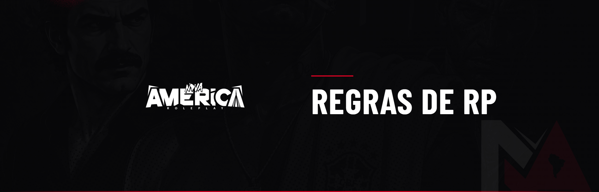

# 🎭 Regras de RP

Roleplay é a técnica de simular e encenar situações como se fossem a vida real. Cada personagem tem limitações que devem ser respeitadas na interpretação. O bom senso do RP é analisado em toda denúncia — mesmo que a regra não esteja explícita.

***

### Metagaming

Usar informações obtidas **fora do RP** (Discord, stream, chat de live, conversas privadas) dentro do jogo.


**Penalidade:** Prisão de 100 a 150 meses + advertência.


***

### RDM (Random Deathmatch)

Matar sem motivo, contexto ou interação prévia dentro do RP.


**Penalidade:** Prisão de 150 a 180 meses + advertência.


***

### VDM (Vehicle Deathmatch)

Usar o veículo como arma, sem justificativa válida no RP.


**Penalidade:** Prisão de 120 a 150 meses + advertência.


***

### Combat Logging

Deslogar durante uma ação para evitar consequências (abordagem, sequestro, fuga, troca de tiros, transporte ao presídio). Problemas de conexão devem ser informados com print (data e hora) na aba de crashes.


**Penalidade:** Prisão imediata de 180 meses + advertência.


***

### Power RP

Forçar uma interação não prevista ou desproporcional no RP (ex.: forçar abordagem, mutilar refém sem contexto).


**Penalidade:** Prisão de 80 a 120 meses.


***

### Power Gaming

Abusar de mecânicas irreais ou impossíveis na vida real (abuso de colisão, atirar de dentro de veículo 100% blindado, guardar veículo em fuga, correr para dentro de casa blipada). Se o veículo não faz naturalmente, não force.


**Penalidade:** Prisão de 80 a 120 meses.


***

### Amor à Vida

Valorize sua vida em primeiro lugar. É proibido: atacar sozinho ou em número claramente inferior, se colocar em risco sem preocupação com a própria vida, desconsiderar consequências, ou não temer prisão/penalidades.


**Penalidade:** Prisão de 100 a 150 meses.


***

### Quebra de RP

Falar termos OOC ("vou subir suporte", "tô clipando"), usar personagem feminino sem interpretação real só para vantagem, ou usar roupas de fantasia no cotidiano.


**Penalidade:** Prisão de 40 a 60 meses. Reincidência: advertência.


***

### Dark RP

Interpretações sombrias e criminosas inaceitáveis: assédio, LGBTQIA+fobia, terrorismo, suicídio, tortura, racismo e afins.


**Penalidade:** Banimento permanente.


***

### Cop Bait / Golpes

Chamar serviço (polícia, hospital, táxi) para sequestrar, matar ou emboscar quem atende. Também é proibido combinar uma venda e não cumprir.


**Penalidade:** Prisão de 100 a 150 meses.

