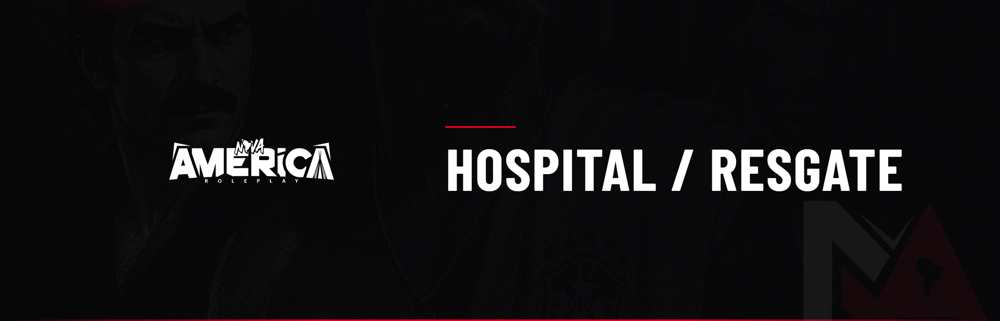

# ⚕️ Hospital / Resgate

O Hospital e o Resgate cuidam da vida dos cidadãos da Nova América. O RP médico é levado a sério e tem peso nas consequências do combate.

***

### Regras gerais

* Proibido usar música dentro do hospital;
* Jogador morto em troca de tiros perde a memória do ocorrido (New Life Rule);
* O resgate deve priorizar sempre a **preservação da vida**;
* A equipe médica decide se um indivíduo tem condições de ser reanimado.

***

### Sobrevivência por intervenção médica

Em troca de tiros com ferimentos fatais ou de extrema gravidade (disparo na cabeça, múltiplos disparos de fuzil no tórax, múltiplos disparos de pistola em áreas vitais), se o indivíduo for encaminhado ao hospital e reanimado, caracteriza-se **sobrevivência por intervenção médica excepcional**.

Nesses casos, o indivíduo **não poderá ser preso** após o atendimento. A polícia pode apenas apreender itens ilícitos e deve liberá-lo.

**Exceção:** se o indivíduo usava **colete à prova de balas** (vestimenta correspondente) e os disparos foram **exclusivamente de pistola**, predominantemente no tórax, entende-se que houve mitigação do dano. Nesse caso, se reanimado, poderá ser preso normalmente.


Essa regra se aplica a ferimentos de alta letalidade em confronto armado, valorizando o roleplay médico, os equipamentos e as consequências do combate.

