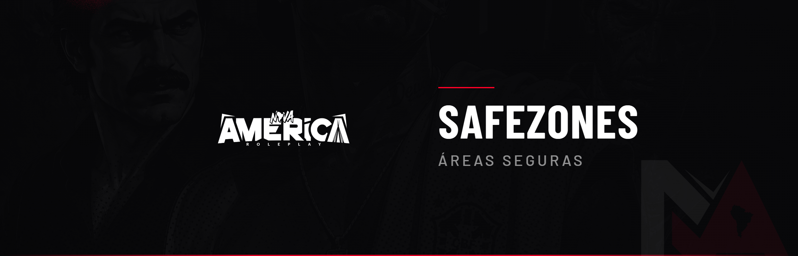

# 🏳️ Safezones

As **Safezones** (áreas seguras) são locais onde nenhuma ação ilegal é permitida. Servem para garantir pontos de convívio livres de conflito.

***

### Como funcionam

* Áreas seguras (safe zones): **proibido** qualquer ação ilegal — assalto, sequestro, troca de tiro, roubo ou furto;
* Áreas de risco: locais controlados pelo crime, com atividade ilícita e risco à vida (bala perdida, roubo, sequestro);
* Ao entrar em uma área de risco, o cidadão **assume todos os riscos** envolvidos.

***

### Locais protegidos

Incluem-se como áreas seguras (entre outros): entrada e interior do hospital, delegacias, e demais pontos definidos pela administração.


**Penalidade (ação ilegal em safezone):** Prisão + possível advertência, conforme a gravidade e o impacto no RP.



Dentro e em frente ao hospital ilegal e locais de farm também é proibido qualquer tipo de ação (sequestro, troca de tiro, roubo). É proibido "marcar" ou rondar essas áreas.

