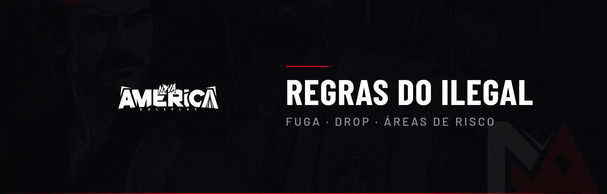

# 🔞 Regras do Ilegal

Este código regula a atuação das facções e organizações criminosas da Nova América — fuga, drop, áreas de risco e conduta no crime.

***

## Conduta geral

* Membros e líderes de facção **não podem lembrar** de nada relacionado ao ilegal quando tomam PD;
* Proibido manter a setagem de um membro que foi finalizado (PD);
* Proibido aliança **bélica** entre facções — permitida apenas aliança econômica;
* A cidade segue o tema **São Paulo**: proibido roupas padronizadas, andar descalço ou comportamento de "tropinha PVP".

***

## Fuga

* Proibido "soco" em fuga a pé (liberado apenas se o jogador nadar no mar);
* Permitida troca de veículo na fuga **1 vez** sem tiro no pneu; a partir da 2ª, tiro no pneu liberado;
* Fuga para a própria base é permitida, mas a polícia pode continuar a ação dentro dela — proibido emboscar;
* Se a fuga se tornar impossível (pneu furado, carro preso/quebrado), pode-se reagir sem que seja "desce e quebra";
* QRR não pode armar emboscada (seria Cop Bait);
* Se capotar ou cair da moto, parar o veículo e seguir a pé, ou vira Power Gaming;
* Máximo de **4 viaturas** na perseguição (3 motos = 1 VTR, 1 heli = 1 VTR).


**Penalidade:** Prisão + advertência conforme a quebra.


***

## Desce e Quebra (DROP)

Descer e quebrar **sem antes fazer uma fuga**, priorizando a preservação da vida e recorrendo ao confronto só como último recurso.

* **No NORTE:** permitido descer e quebrar **após realizar uma fuga**;
* **No SUL (Cidade):** **proibido** em qualquer circunstância, exceto em perda de fuga (pneu furado ou carro parado);
* QRR do ilegal só é permitido depois que o desce-quebra começar;
* Proibido ficar pessoas esperando no local para quebrar.


**Penalidade:** Punição grave em caso de quebra.


***

## Áreas de Risco

* A polícia patrulha a comunidade apenas para policiamento preventivo (sem abordagem), precisando de motivo plausível para abordar;
* Ao entrar na área de risco, o cidadão assume os riscos (bala perdida, roubo, sequestro);
* **Pacificação:** combate ao crime na comunidade, podendo neutralizar todos os armados. Itens ilegais à vista são apreendidos, mas o baú da facção **não** é acessado;
* **Loot de policiais:** permitido apenas em áreas de risco e com confronto direto, para quem participou da ação;
* **Venda de drogas:** proibida em locais inacessíveis (interior de casa blipada, lajes, áreas trancadas, "bombas").


**Penalidade:** Punições via denúncia + consequências dentro do RP (investigação, operação, quebra de baú).


***

## Hospital ilegal e locais de farm

* Proibido qualquer ação (sequestro, tiro, roubo) dentro/em frente ao hospital ilegal e locais de farm;
* Proibido "marcar" ou rondar essas áreas;
* Proibido levar a polícia ou apontar armas para quem está usando esses locais.


**Penalidade:** Prisão + advertência.

