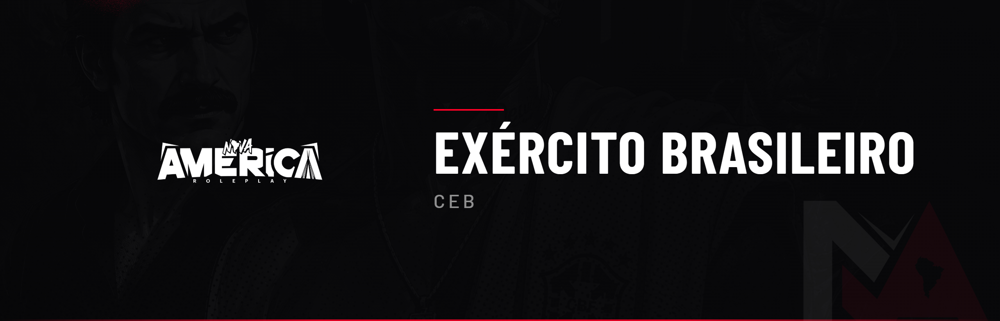

# 🪖 Exército Brasileiro (CEB)

Este código regula a estrutura, a hierarquia e as operações do **Exército Brasileiro** da Nova América. Ele disputa as regiões de extração de matéria-prima (ver CTF) e **fornece armamento à polícia** via sistema de pedidos e comboios.

> ⚠️ **3 ADVERTÊNCIAS RESULTARÃO EM BANIMENTO.**

***

## 1 — Estrutura e Hierarquia

### CEB 1.0 — Hierarquia Militar

Do topo à base:

**Oficiais-Generais:** General de Exército · General de Divisão · General de Brigada
**Oficiais Superiores:** Coronel · Tenente-Coronel · Major
**Oficiais Intermediários/Subalternos:** Capitão · Primeiro-Tenente · Segundo-Tenente · Aspirante a Oficial
**Praças Graduadas:** Primeiro-Sargento · Segundo-Sargento · Terceiro-Sargento · Cabo
**Praças:** Soldado · Recruta

A cadeia de comando é obrigatória. Ordens que quebrem regras da cidade não devem ser cumpridas e devem ser reportadas.


**Penalidade:** Informativo (sem penalidade direta).


***

### CEB 1.1 — Responsabilidade do Comando

Oficiais-Generais e Superiores respondem por: conduta e treinamento da tropa, cumprimento dos prazos de entrega, integridade dos comboios e comunicação com a administração. A omissão configura má-fé.


**Penalidade:** Advertência ao comando. Reincidência: ADV + rebaixamento.


***

## 2 — Fornecimento de Armamento (Sistema MDT)

### CEB 2.0 — Pedido de Armamento

O Exército é o único fornecedor oficial de armamento à polícia. Pelo MDT:

* A polícia solicita **somente às TERÇAS e SEXTAS-FEIRAS**;
* Somente **Major, Tenente-Coronel e Coronel** podem solicitar e confirmar o recebimento;
* Cada pedido informa tipo e quantidade.


**Penalidade:** Pedido fora do dia/patente é anulado. Reincidência: ADV.


***

### CEB 2.1 — Prazos de Resposta e Entrega

* **Até 8 horas** para aceitar ou recusar os pedidos;
* Após o aceite, **até 24 horas** para entregar via comboio;
* Em emergência, até **72 horas**.


**Penalidade:** ADV ao comando. Reincidência: intervenção administrativa.


***

### CEB 2.2 — Conferência de Recebimento

Quem solicitou (Major/Ten-Cel/Coronel) confere e confirma no MDT, comparando o pedido com o entregue. Divergências devem ser reportadas via ticket com clipe.


**Penalidade:** Confirmação falsa: ADV ao responsável.


***

## 3 — Comboio Militar

### CEB 3.0 — Transporte por Comboio

A entrega é feita por comboio da base até a cidade. Pode ser alvo de assalto no trajeto. A carga só é entregue após conferência e confirmação.


**Penalidade:** Informativo (sem penalidade direta).


***

### CEB 3.1 — Corrupção no Comboio

Se faltar armamento na conferência, o **chefe do comboio** é o responsável. Punição escalonada:

* **1ª ocorrência / diferença pequena:** reposição do prejuízo + advertência interna no MDT;
* **Reincidência ou diferença grande:** desvio/corrupção → **prisão de 100 a 150 meses + investigação da Corregedoria Militar + rebaixamento**.


**Penalidade:** Conforme escalonamento. Má-fé: ADV de organização + possível banimento.


***

### CEB 3.2 — Assalto ao Comboio

Uma facção pode roubar o comboio no trajeto, com regras rígidas:

* Exige **autorização prévia da administração** (rodízio — só a facção do dia autorizada);
* Máximo de **15 membros**;
* Ao roubar, deve **guardar o caminhão** e **abrir ticket**;
* Assalto bem-sucedido garante **premiação**.


**Penalidade:** Sem autorização: prisão de 150 meses + ADV de FAC. Excesso/ação irreal: anulação + ADV. Reincidência: suspensão do rodízio.


***

### CEB 3.3 — Recuperação do Comboio Roubado

A polícia só pode tentar recuperar o comboio roubado se:

* Houver **investigação** que, em poucas horas, **identifique a favela** responsável;
* Houver **autorização** dentro do prazo determinado;
* A recuperação seja feita **somente pelas forças especializadas autorizadas** a subir favela (ver Forças Especializadas). A polícia convencional não sobe.


**Penalidade:** Anulação da recuperação + ADV, se feita sem investigação, sem autorização ou por força não autorizada.


***

## 4 — Território e Autonomia

### CEB 4.0 — Disputa de Território

O Exército Brasileiro disputa as regiões de extração contra o Exército do Paraguai, seguindo o CTF, incluindo o cooldown de 48h.


**Penalidade:** Conforme CTF.


***

### CEB 4.1 — Autonomia Administrativa

A administração pode intervir na estrutura, ajustar prazos, remover comandos e anular entregas ou assaltos obtidos por quebra de regra.


**Penalidade:** Informativo (sem penalidade direta).

