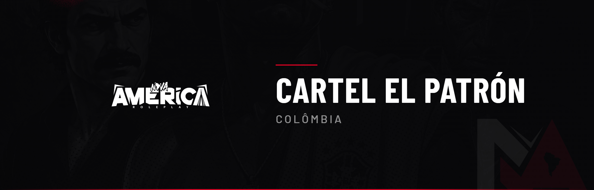

# 🏴 Cartel El Patrón (Colômbia)

Este código regula o **Cartel El Patrón**, que domina a Colômbia (Ilha de Cayo Perico) a partir de seu quartel. O cartel controla a produção de drogas do continente e tem autoridade sobre as facções de drogas.

> ⚠️ **3 ADVERTÊNCIAS RESULTARÃO EM BANIMENTO.**

***

## 1 — Autoridade do Cartel

### CCT 1.0 — Domínio da Colômbia

El Patrón domina a Colômbia e sua ilha. O cartel controla toda a **produção de drogas** e gerencia a rede de favelas e distribuição ligada a esse mercado, expandindo seu poder para o Brasil e o restante do continente.


**Penalidade:** Informativo (sem penalidade direta).


***

### CCT 1.1 — Autoridade sobre as Facções de Droga

O cartel tem **autoridade sobre as facções de drogas**:

* Supervisiona e fiscaliza a atuação delas;
* Pode **visitar** as facções e está acima delas na hierarquia do tráfico;
* Nenhuma facção de drogas cresce sem o aval do cartel.


**Penalidade:** Perda de acordo + corte de fornecimento para a facção que desrespeitar a autoridade do cartel.


***

## 2 — Acesso e Produção

### CCT 2.0 — Acordo e Autorização

Para acessar a Colômbia, plantar, cultivar e fabricar drogas, a facção precisa de **acordo/autorização do cartel**:

* O acesso à Colômbia sem autorização é **proibido**;
* A facção autorizada pode entrar para plantar, cultivar e fabricar;
* O acordo é a base da parceria com o cartel.


**Penalidade:** Prisão de 120 a 180 meses + perda de acordo, para acesso sem autorização.


***

### CCT 2.1 — Produção de Drogas

Toda a produção de drogas que abastece o Brasil é fabricada na Colômbia, com a matéria-prima e sob a gestão do cartel. As rotas e o domínio territorial devem ser respeitados.


**Penalidade:** Prisão + perda de acordo, para produção fora das regras do cartel.


***

### CCT 2.2 — Proibição de Conflito Armado

É **estritamente proibido** qualquer conflito armado dentro da Colômbia:

* Sem troca de tiros, assaltos, sequestros ou ações hostis no território;
* A Colômbia é zona de negócio, sob a autoridade do cartel;
* A permanência é regida pelas regras do cartel.


**Penalidade:** Prisão de 120 a 180 meses + perda de acordo + bloqueio de acesso.


***

## 3 — Território e Autonomia

### CCT 3.0 — Soberania Territorial

A Colômbia é soberania do cartel, seguindo o CTF quanto ao acesso e conduta no território.


**Penalidade:** Conforme CTF.


***

### CCT 3.1 — Autonomia Administrativa

A administração pode intervir na estrutura do cartel, ajustar acordos, remover lideranças e anular ações obtidas por quebra de regra.


**Penalidade:** Informativo (sem penalidade direta).

