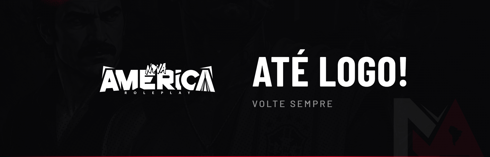

# 👋 Até Logo!

Obrigado por fazer parte da **Nova América Roleplay**. Volte sempre.

Você chegou ao fim do nosso manual de regras. A partir daqui, o que constrói a cidade é você — cada ação, cada história, cada escolha.

***


**ATENÇÃO**

Ao permanecer na Nova América, o jogador declara estar ciente de que todos os códigos, normas e diretrizes aqui descritos estão publicamente disponíveis para consulta. O desconhecimento ou a interpretação equivocada de qualquer conteúdo **não** isenta o jogador de responsabilidade, tampouco de sanções administrativas ou roleplay.

A Administração da Nova América reserva-se o direito de interpretar, aplicar, agravar ou flexibilizar sanções, sempre visando a preservação do Roleplay sério, da economia, da narrativa e da integridade do projeto. Este documento possui caráter normativo e vinculativo, sendo parte integrante dos Termos de Uso da Nova América.


**2026 © NOVA AMÉRICA ROLEPLAY — IRON VISION GROUP — TODOS OS DIREITOS RESERVADOS**
