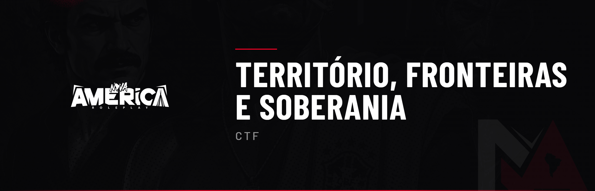
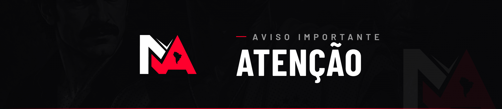

Este código regulamenta a geografia, as fronteiras, a soberania dos territórios e a disputa pelas regiões de extração de matéria-prima da **Nova América**. Define quem controla cada país, como se atravessa uma fronteira e como funciona a dominação territorial entre o **Exército Brasileiro** e o **Exército do Paraguai**.

Serve como base máxima para julgamento por parte da **Staff, Responsáveis do Ilegal e Administração Geral**.


⚠️ **3 ADVERTÊNCIAS RESULTARÃO EM BANIMENTO.**


***

### CTF 1.0 — Geografia da Nova América

O mapa é dividido em três soberanias, do topo à base:

* **NORTE — PARAGUAI:** país sob controle das forças milicianas (Exército do Paraguai). Fabrica armamentos e munições, e abastece as facções de armas do Brasil.
* **CENTRO — BRASIL (São Paulo):** a cidade principal, onde vivem civis, polícia e facções.
* **SUL — COLÔMBIA (Ilha de Cayo Perico):** domínio do Cartel El Patrón, fornecedor de matéria-prima e drogas.

Cada território possui regras próprias de acesso, conduta e soberania, detalhadas neste e nos códigos específicos (**CEB**, **CEP** e **CCT**).


**PENALIDADE:** Informativo (sem penalidade direta).


***

### CTF 1.1 — Fronteiras e Passagem

As fronteiras são reais e o sistema identifica em qual país o jogador se encontra. Para transitar entre países é obrigatório:

* Portar **passaporte** válido;
* Portar **CNH** quando conduzindo veículo;
* Portar **registro/porte de arma** quando armado, conforme a legislação do território.

É **proibido**:

* Atravessar fronteira por rotas irreais (pular barreira, contornar por fora do mapa, usar bug de terreno);
* Ignorar a abordagem da autoridade responsável pela fronteira;
* Usar documento falso sem RP prévio que o justifique.


**PENALIDADE:**

* Prisão de 60 a 100 meses
* Apreensão de itens ilícitos e do veículo


***

### CTF 1.2 — Controle de Fronteira (PRF)

A **Polícia Rodoviária Federal (PRF)** é a autoridade responsável pelo controle da fronteira **Brasil–Paraguai**. Compete à PRF:

* Fiscalizar documentos (passaporte, CNH, porte) na passagem;
* Abordar veículos e indivíduos em fundada suspeita;
* Comunicar via rádio fugas que cruzem a fronteira.

Policiais **Civis, Militares e GCM** **não** realizam trabalho fixo de fronteira, salvo em perseguição de indivíduo em fuga — que deve ser comunicada à PRF pelo rádio.


**PENALIDADE:**

* ADV à corporação
* Reincidência: ADV + suspensão de operações na fronteira


***

### CTF 1.3 — Regiões de Extração de Matéria-Prima

Existem **2 (duas) regiões de extração** de matéria-prima, disputadas pelo **Exército Brasileiro** e pelo **Exército do Paraguai**:

* **REGIÃO 1 — território BRASILEIRO:** matéria-prima destinada à cadeia de produção nacional;
* **REGIÃO 2 — território PARAGUAIO:** matéria-prima destinada à fabricação de armamentos e munições.

Quem domina uma região controla a extração de sua matéria-prima até que a dominação seja legitimamente retomada. As duas regiões são disputadas de forma **independente** — dominar uma não dá direito sobre a outra.


**PENALIDADE:** Informativo (sem penalidade direta).


***

### CTF 1.4 — Dominação e Cooldown de 48h

Ao dominar uma região de extração, o exército vencedor passa a controlá-la. A partir da dominação:

* O exército derrotado só poderá tentar **retomar a região após 48 (quarenta e oito) horas**;
* O cooldown de 48h é contado **por região**, de forma independente;
* Durante o cooldown, é proibido qualquer conflito armado pela mesma região — quebra a física do RP de colonização;
* A dominação e o horário devem ser **registrados (clipe/ticket)** para contagem oficial do cooldown.

É **proibido**:

* Retomar a região antes das 48h;
* Simular perda para "zerar" o cooldown a favor do outro lado;
* Disputar sem plano de RP ou em rush suicida.


**PENALIDADE:**

* Prisão de 120 meses
* ADV de FAC / Corporação
* Reincidência: suspensão da disputa territorial


***

### CTF 1.5 — Soberania do Território Paraguaio

O território paraguaio é comandado pelo **Exército do Paraguai**, que realiza o policiamento e as abordagens dentro de suas fronteiras, verificando quem pode ou não permanecer no país.

* O Exército do Paraguai pode **abordar, revistar e expulsar** indivíduos não autorizados;
* Civis e facções que entram **assumem os riscos** do território;
* Desacatar ou atacar o Exército do Paraguai sem contexto configura quebra grave.


**PENALIDADE:**

* Prisão de 100 a 150 meses
* Expulsão do território e bloqueio temporário de acesso


***

### CTF 1.6 — Soberania da Colômbia (Cartel)

A **Colômbia (Ilha de Cayo Perico)** é domínio do **Cartel El Patrón**. O acesso é permitido somente com autorização do cartel, conforme o **Código do Cartel (CCT)**.

* É **proibido** qualquer conflito armado dentro da Colômbia;
* O acesso sem autorização do cartel é proibido;
* A permanência é regida pela autoridade do cartel sobre as facções de droga.


**PENALIDADE:**

* Prisão de 120 a 180 meses
* Perda de acordo com o cartel


***

### CTF 1.7 — Autonomia Administrativa

A administração possui **autonomia total** para intervir em disputas territoriais, ajustar cooldowns, anular dominações obtidas por quebra de regra, encerrar operações e aplicar sanções quando o RP de território fugir da proposta da cidade.


**PENALIDADE:** Informativo (sem penalidade direta).


***

Ao permanecer na **Nova América**, o jogador declara estar ciente de que todos os códigos, normas, regras e diretrizes aqui descritos encontram-se publicamente disponíveis para consulta. O desconhecimento, a não leitura ou a interpretação equivocada de qualquer conteúdo **não** isenta o jogador de responsabilidade, tampouco de sanções administrativas ou roleplay.

A Administração da Nova América reserva-se o direito de interpretar, aplicar, agravar ou flexibilizar sanções, sempre visando a preservação do Roleplay sério, da economia, da narrativa e da integridade do projeto. Este documento possui caráter normativo e vinculativo, sendo parte integrante dos **Termos de Uso da Nova América**.

